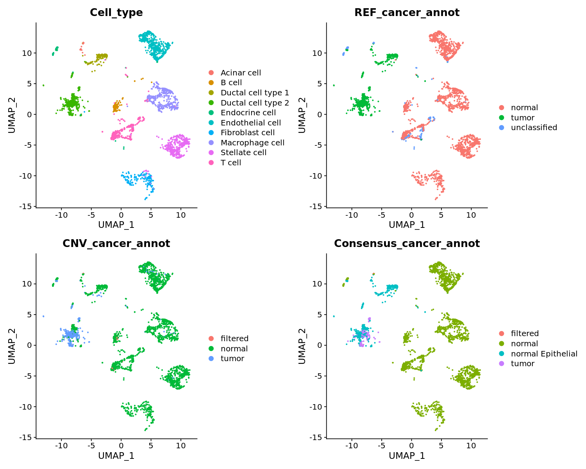

# MACE

### MAlignant CEll annotation

Annotate tumor vs normal cells using single-cell RNA-sequencing data, using three different methods: CNV-based (SCEVAN), Reference-based (scATOMIC) and Consensus.

<p align="center">
  
</p>

## Installation

### 1. SCEVAN (CNV-based method)

For detailed installation, please refer to the original [SCEVAN](https://github.com/AntonioDeFalco/SCEVAN) repository.

Briefly, run the following

``` r
devtools::install_github("miccec/yaGST")
devtools::install_github("AntonioDeFalco/SCEVAN")
```

### 2. scATOMIC (Reference-based method)

For detailed installation, please refer to the original [scATOMIC](https://github.com/abelson-lab/scATOMIC/tree/main) repository.

Briefly, run the following

``` r
devtools::install_version("dlm", version = "1.1.5", repos = "http://cran.us.r-project.org")
devtools::install_version("Rmagic", version = "2.0.3", repos = "http://cran.us.r-project.org")
devtools::install_github("inofechm/cutoff.scATOMIC", force = T)
options(timeout=9999999)        # To avoid timeout due to large package size
devtools::install_github("abelson-lab/scATOMIC")
```
In scATOMIC, the Rmagic package to impute values. 

To use MAGIC, you will need to install both the R and Python packages.

If python or pip are not installed, you will need to install them. [Miniconda3](https://conda.io/miniconda.html) is recommended to install Python and pip together, or otherwise you can install pip from <https://pip.pypa.io/en/stable/installing/>.

In a terminal, run the following command in command line to install the
Python repository:

``` bash
pip install --user magic-impute
```

Often the python magic module is not loading properly in R and the
following in R is producing FALSE:

``` r
Rmagic::pymagic_is_available()
```

To resolve this issue run:

``` r
library(reticulate)
library(Rmagic)
install.magic()
pymagic_is_available()
```
For more information about MAGIC, please visit <https://github.com/cran/Rmagic>

### 3. MACE

The MACE package can be installed from GitHub

``` r
devtools::install_github("genmab/MACE")
```

## Usage

First load MACE, which will automatically load all dependencies

``` r
library(MACE)
```

Load sample data available from the MACE package, a Seurat object containing a downsampled version (only 3 biological samples) of the [Peng_et_al](https://www.nature.com/articles/s41422-019-0195-y) PDAC dataset.

```r
data(Peng_PDAC_3)
```

Run MACE annotation using the three methods, MACE_REF, MACE_CNV and MACE_consensus

```r
Peng_PDAC_3 <- MACE_REF(Peng_PDAC_3, donor_id_col="Patient")
Peng_PDAC_3 <- MACE_CNV(Peng_PDAC_3, donor_id_col="Patient")
Peng_PDAC_3 <- MACE_consensus(Peng_PDAC_3, donor_id_col="Patient")
```

Visualize the output annotations in comparison to the authors cell type annotation, where the Ductal cell type 2 are considered the cancerous cells by the authors. It is observed that the Reference annotation grouped Ductal cell type 1 and 2 together with acinar cells as being tumor cells. While CNV correctly separated the Ductal cell type 2 (being tumor) from acinar cell and Ductal cell type 1 (being normal), CNV annotation produce few mistakes in normal cells being tumor. The Consensus annotation combine the benefits of both methods: 1. Calling normal cell types as normal, 2. Correcting the acinar cells and Ductal cell type 1 to normal (named normal Epithelial), together with Ductal cell type 2 cells without CNVs, and 3. Calling Ductal cell type 2 cells with CNVs as tumor cells. This produces the highest precision and confidence in the tumor annotation.

```r
DimPlot(Peng_PDAC_3[,(Peng_PDAC_3$Consensus_cancer_annot != 'filtered' & Peng_PDAC_3$CNV_cancer_annot != 'filtered' & Peng_PDAC_3$REF_cancer_annot != 'unclassified')], reduction = "umap", group.by=c('Cell_type','REF_cancer_annot', 'CNV_cancer_annot','Consensus_cancer_annot'))
```

<p align="center">
  
</p>

### Session Info

``` r
sessionInfo()
```

    ## R version 4.1.3 (2022-03-10)
    ## Platform: x86_64-pc-linux-gnu (64-bit)
    ## Running under: Ubuntu 20.04.4 LTS
    ## 
    ## Matrix products: default
    ## BLAS:   /usr/lib/x86_64-linux-gnu/blas/libblas.so.3.9.0
    ## LAPACK: /usr/lib/x86_64-linux-gnu/lapack/liblapack.so.3.9.0

    ## locale:
    ## [1] C

    ## attached base packages:
    ## [1] parallel  stats     graphics  grDevices utils     datasets  methods  
    ## [8] base     
    ## 
    ## other attached packages:
    ##  [1] MACE_0.1.0            SCEVAN_1.0.1          yaGST_2017.08.25     
    ##  [4] doParallel_1.0.17     iterators_1.0.14      foreach_1.5.2        
    ##  [7] copykat_1.1.0         cutoff.scATOMIC_0.1.0 agrmt_1.42.8         
    ## [10] SeuratObject_4.1.3    Seurat_4.3.0          Rmagic_2.0.3         
    ## [13] Matrix_1.5-3          reticulate_1.28       caret_6.0-93         
    ## [16] lattice_0.20-45       ggplot2_3.4.0         randomForest_4.7-1.1 
    ## [19] data.table_1.14.6     dplyr_1.1.0           plyr_1.8.8           
    ## [22] scATOMIC_2.0.2       
    ## 
    ## loaded via a namespace (and not attached):
    ##   [1] Rtsne_0.16             colorspace_2.1-0       deldir_1.0-6          
    ##   [4] hwriter_1.3.2          ellipsis_0.3.2         class_7.3-20          
    ##   [7] ggridges_0.5.4         rprojroot_2.0.3        spatstat.data_3.0-0   
    ##  [10] leiden_0.4.3           listenv_0.9.0          ggrepel_0.9.3         
    ##  [13] prodlim_2019.11.13     fansi_1.0.4            lubridate_1.9.1       
    ##  [16] codetools_0.2-18       splines_4.1.3          polyclip_1.10-4       
    ##  [19] jsonlite_1.8.4         pROC_1.18.0            ica_1.0-3             
    ##  [22] cluster_2.1.3          png_0.1-8              uwot_0.1.14           
    ##  [25] spatstat.sparse_3.0-0  sctransform_0.3.5      shiny_1.7.4           
    ##  [28] compiler_4.1.3         httr_1.4.4             fastmap_1.1.0         
    ##  [31] lazyeval_0.2.2         cli_3.6.0              later_1.3.0           
    ##  [34] htmltools_0.5.4        tools_4.1.3            igraph_1.3.5          
    ##  [37] gtable_0.3.1           glue_1.6.2             RANN_2.6.1            
    ##  [40] reshape2_1.4.4         rappdirs_0.3.3         Rcpp_1.0.10           
    ##  [43] scattermore_0.8        vctrs_0.5.2            spatstat.explore_3.0-6
    ##  [46] nlme_3.1-157           progressr_0.13.0       lmtest_0.9-40         
    ##  [49] spatstat.random_3.1-3  timeDate_4022.108      gower_1.0.1           
    ##  [52] stringr_1.5.0          globals_0.16.2         timechange_0.2.0      
    ##  [55] mime_0.12              miniUI_0.1.1.1         lifecycle_1.0.3       
    ##  [58] irlba_2.3.5.1          hwriterPlus_1.0-3      goftest_1.2-3         
    ##  [61] future_1.31.0          SparkR_3.2.0           MASS_7.3-56           
    ##  [64] zoo_1.8-11             scales_1.2.1           ipred_0.9-13          
    ##  [67] spatstat.utils_3.0-1   promises_1.2.0.1       RColorBrewer_1.1-3    
    ##  [70] gridExtra_2.3          pbapply_1.7-0          TeachingDemos_2.12    
    ##  [73] rpart_4.1.16           stringi_1.7.12         hardhat_1.2.0         
    ##  [76] lava_1.7.1             rlang_1.0.6            pkgconfig_2.0.3       
    ##  [79] matrixStats_0.63.0     tensor_1.5             ROCR_1.0-11           
    ##  [82] purrr_1.0.1            recipes_1.0.4          patchwork_1.1.2       
    ##  [85] htmlwidgets_1.6.1      cowplot_1.1.1          tidyselect_1.2.0      
    ##  [88] here_1.0.1             parallelly_1.34.0      RcppAnnoy_0.0.20      
    ##  [91] magrittr_2.0.3         R6_2.5.1               generics_0.1.3        
    ##  [94] pillar_1.8.1           withr_2.5.0            fitdistrplus_1.1-8    
    ##  [97] abind_1.4-5            survival_3.2-13        sp_1.6-0              
    ## [100] nnet_7.3-17            tibble_3.1.8           future.apply_1.10.0   
    ## [103] KernSmooth_2.23-20     utf8_1.2.3             spatstat.geom_3.0-6   
    ## [106] Rserve_1.8-10          plotly_4.10.1          grid_4.1.3            
    ## [109] ModelMetrics_1.2.2.2   digest_0.6.29          xtable_1.8-4          
    ## [112] tidyr_1.3.0            httpuv_1.6.8           stats4_4.1.3          
    ## [115] munsell_0.5.0          viridisLite_0.4.1